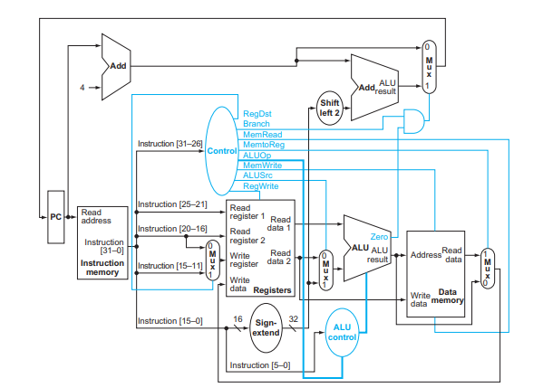

# Design_Single-Cycle-MIPS32-ISA-Custom-Processor

**Author:** Yandrapu Jaya Kushal  
**GitHub:** [jayakushal24](https://github.com/jayakushal24)

This project is a Verilog-based implementation of a single-cycle CPU architecture adhering to the MIPS32 Instruction Set Architecture (ISA). It is part of a personal initiative to strengthen understanding in computer architecture and RTL design.

> This project was undertaken as a personal learning initiative to deepen my understanding of processor architecture, digital design, and the MIPS32 instruction set.  
> The goal was to implement a functional single-cycle processor entirely in Verilog, simulating core components such as instruction decoding, register file handling, memory operations, and ALU computations.  
> Through this project, I successfully developed a working MIPS32 processor capable of executing a variety of basic R-type and I-type instructions.  
> This hands-on experience significantly enhanced my practical knowledge of computer architecture, RTL design, and the functional flow of instruction execution in a CPU.

## 🔧Extension of Existing Architecture for Jump Instruction Support

To extend the processor's instruction set, the architecture was modified to implement support for the **jump (j)** instruction.

### 🗂 Location of Modified Design

The updated architecture and Verilog source code with jump instruction support can be found in the following folder:  
`/My Modified Architecture`

### ✅ Results

These modifications enabled successful execution of programs containing jump (`j`) instructions, verified by correct operation and waveform validation.

## 🧱 Architecture 

This processor was designed based on the standard single-cycle MIPS32 architecture shown below. All modules (PC, ALU, Register File, Control Unit, Data Memory, etc.) strictly adhere to this structure.

📖 **Reference Architecture Source:**  
[https://www.cs.nthu.edu.tw/~king/courses/cs4100/P51-proc.pdf](https://www.cs.nthu.edu.tw/~king/courses/cs4100/P51-proc.pdf)

- **Program Counter (PC):** Holds address of the current instruction.
- **Instruction Memory:** Outputs 32-bit instruction at the PC address.
- **Instruction Decoder:** Extracts fields (opcode, rs, rt, rd, shamt, funct).
- **Control Unit:** Generates control signals based on opcode.
- **Register File:** Reads two registers, writes to one.
- **Sign-Extend:** Converts 16-bit immediate to 32-bit signed value.
- **ALU Control:** Decodes `funct` with `ALUOp` to control ALU operation.
- **ALU:** Performs arithmetic/logical operations.
- **Data Memory:** Load/store operations based on control signals.
- **Multiplexers (MUX):** Select paths for register destination, ALU operand, memory result, and PC update.
- **Shift Left 2 & Branch Adder:** Used for branch address computation.
- **Branch Logic:** Determines branch condition.

## 🔍 Sample Instruction Set

| Address | Instruction | Assembly |
|---------|-------------|----------|
| 0x00    | 20080004    | addi $t0, $zero, 4 |
| 0x04    | 20090003    | addi $t1, $zero, 3 |
| 0x08    | 01095020    | add  $t2, $t0, $t1 |
| 0x0C    | 012A5822    | sub  $t3, $t1, $t2 |
| 0x10    | AC0A0004    | sw   $t2, 4($zero) |
| 0x14    | 8C0C0004    | lw   $t4, 4($zero) |
| 0x18    | 110C0002    | beq  $t0, $t4, +2  |
| 0x1C    | 200D0001    | addi $t5, $zero, 1 |
| 0x20    | 200D0002    | addi $t5, $zero, 2 |
| 0x24    | 11AD0001    | beq  $t5, $t5, +1  |
| 0x28    | 200E00FF    | addi $t6, $zero, 255 |
| 0x2C    | 200E0001    | addi $t6, $zero, 1 |
| 0x30    | 200E0002    | addi $t6, $zero, 2 |
| 0x34    | 200E0003    | addi $t6, $zero, 3 |

## 🛠️ Simulation Instructions

1. Open Vivado or any Verilog simulator.
2. Add all `.v` modules and `testbench.v`.
3. Set `testbench.v` as the top module.
4. Run behavioral simulation.
5. Inspect waveform to verify expected register/memory values.

## ✅ Result

The single-cycle MIPS32 processor was successfully built and verified. It executes test programs with correct instruction flow and data manipulation, supporting essential instruction types with full memory/register interfacing.

